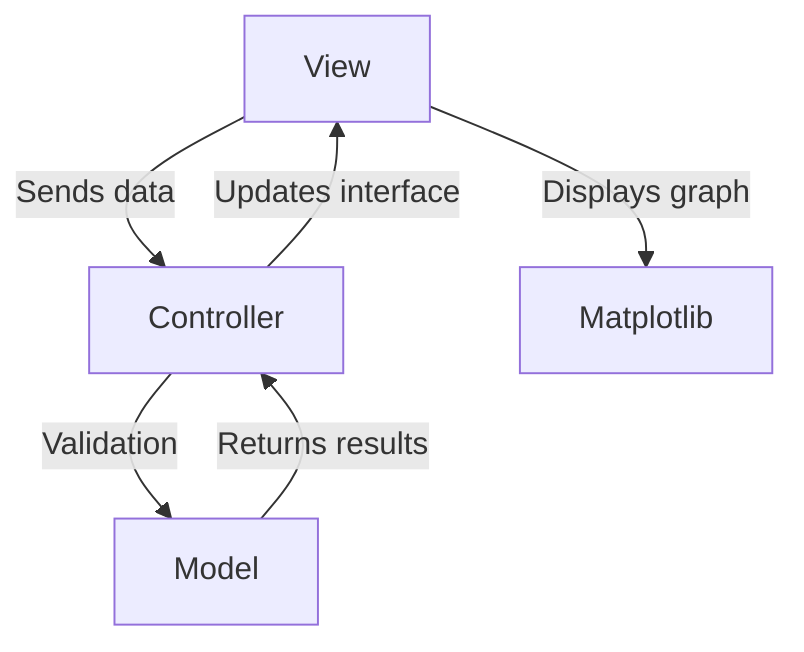
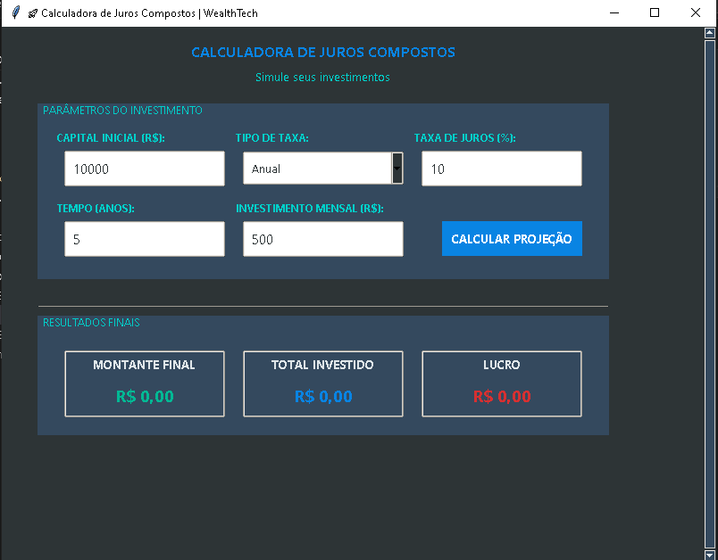
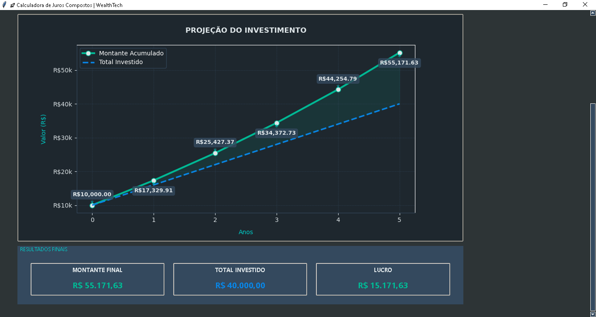
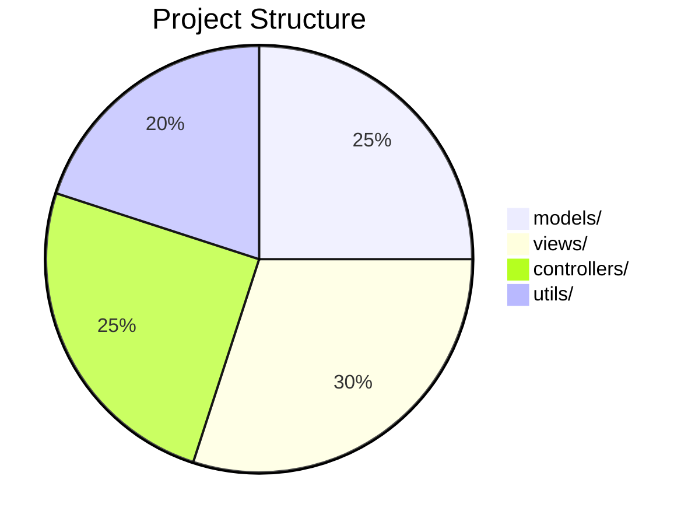
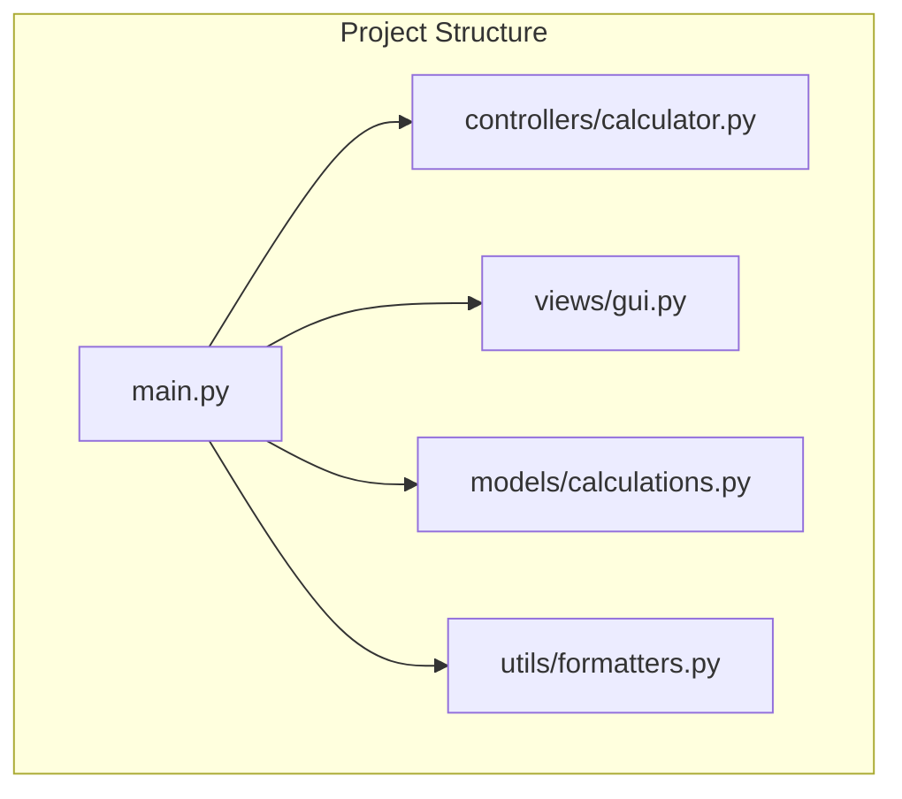
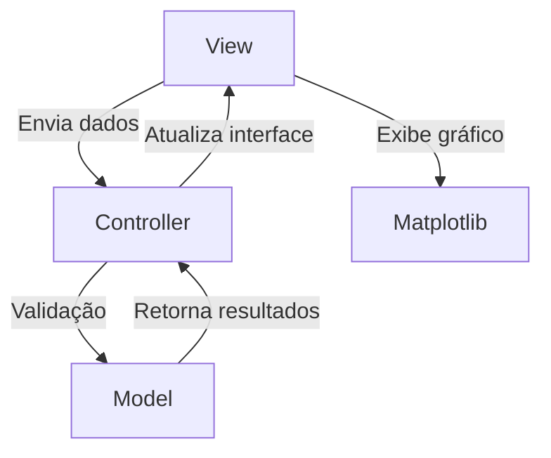
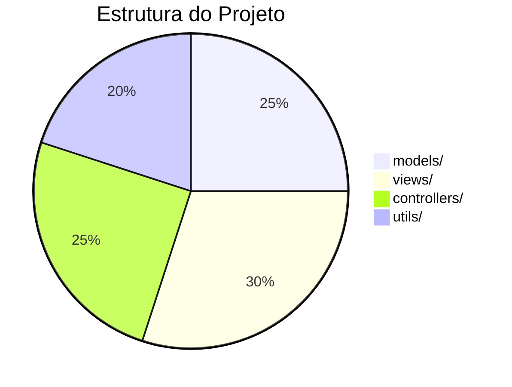
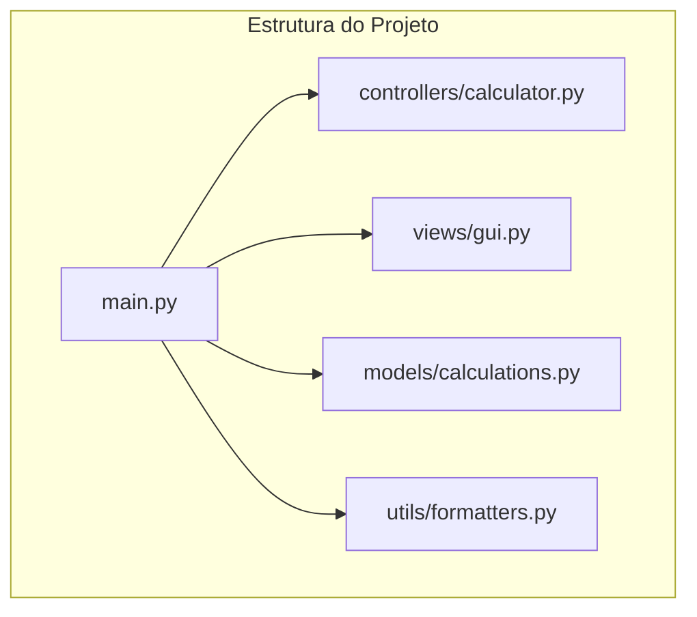

# 📊 Compound Interest Calculator - Learning Project


This project is a compound interest calculator developed for educational purposes, showcasing best practices for organizing Python code in professional projects.

## 🎯 Main Objective

Teach how to organize a Python project in a professional structure following the MVC (Model-View-Controller) pattern:


## 📷 Prints




## ✨ Key Features

- 💰 Accurate compound interest calculations
- 📈 Interactive graphical visualization
- 🎨 Intuitive interface with Tkinter
- ✅ Robust input validation
- 💵 Automatic currency formatting
- 🖥️ Responsive design for various screen sizes

## 🛠️ How to Run

1. **Clone the repository**:
   ```bash
   git clone https://github.com/Monokatarina/compound-interest.git
   cd compound-interest
   ```

2. **Install dependencies**:
   ```bash
   pip install -r requirements.txt
   ```

3. **Run the program**:
   ```bash
   python main.py
   ```

## 🧠 Key Concepts Learned

### Professional Organization


### Technologies Used
| Technology | Purpose |
|------------|---------|
| Python     | Core logic |
| Tkinter    | Graphical interface |
| Matplotlib | Data visualization |
| Mermaid    | Diagrams in README |

## 📚 Detailed Structure



**Complete Legend**:
- `models/`: Contains mathematical formulas
- `views/`: User interface and graphs
- `controllers/`: Validation and flow control
- `utils/`: Auxiliary functions

## 🤝 How to Contribute

1. Fork the project
2. Create a branch for your feature (`git checkout -b feature/amazing-feature`)
3. Commit your changes (`git commit -m 'Add amazing feature'`)
4. Push to the branch (`git push origin feature/amazing-feature`)
5. Open a Pull Request

## 📄 License

This project is licensed under the MIT License - see the [LICENSE](LICENSE) file for details.

---

Made with ❤️ by [Monokatarina] - Transforming lines of code into knowledge! 🚀

[](https://github.com/Monokatarina/compound-interest)
[](https://github.com/Monokatarina/compound-interest/network)

## 🏆 Usage Example

```python
# Simplified example of the main logic
from models.calculations import calculate_compound_interest

result = calculate_compound_interest(
    principal=1000,
    interest_rate=8,  # 8% per year
    time=5            # 5 years
)
print(f"Final amount: ${result:,.2f}")
```

---

# 📊 Calculadora de Juros Compostos - Projeto de Aprendizado

[](https://github.com/Monokatarina/juros-compostos)
[](https://github.com/Monokatarina/juros-compostos/network)

Este projeto é uma calculadora de juros compostos desenvolvida para fins educacionais, demonstrando boas práticas de organização de código em projetos profissionais.

## 🎯 Objetivo Principal

Ensinar como organizar um projeto Python em uma estrutura profissional seguindo o padrão MVC (Model-View-Controller):



## ✨ Funcionalidades Principais

- 💰 Cálculo preciso de juros compostos
- 📈 Visualização gráfica interativa
- 🎨 Interface intuitiva com Tkinter
- ✅ Validação robusta de entradas
- 💵 Formatação monetária automática
- 🖥️ Responsividade para diferentes tamanhos de tela

## 🛠️ Como Executar

1. **Clone o repositório**:
   ```bash
   git clone https://github.com/Monokatarina/juros-compostos.git
   cd juros-compostos
   ```

2. **Instale as dependências**:
   ```bash
   pip install -r requirements.txt
   ```

3. **Execute o programa**:
   ```bash
   python main.py
   ```

## 🧠 Conceitos Aprendidos

### Organização Profissional


### Tecnologias Utilizadas
| Tecnologia | Finalidade |
|------------|------------|
| Python     | Lógica principal |
| Tkinter    | Interface gráfica |
| Matplotlib | Visualização de dados |
| Mermaid    | Diagramas no README |

## 📚 Estrutura Detalhada



**Legenda Completa**:
- `models/`: Contém as fórmulas matemáticas
- `views/`: Interface do usuário e gráficos
- `controllers/`: Validação e controle de fluxo
- `utils/`: Funções auxiliares

## 🤝 Como Contribuir

1. Faça um fork do projeto
2. Crie uma branch para sua feature (`git checkout -b feature/incrivel`)
3. Commit suas mudanças (`git commit -m 'Adiciona feature incrível'`)
4. Push para a branch (`git push origin feature/incrivel`)
5. Abra um Pull Request

## 📄 Licença

Este projeto está licenciado sob a licença MIT - veja o arquivo [LICENSE](LICENSE) para detalhes.

---

Feito com ❤️ por [Monokatarina] - Transformando linhas de código em conhecimento! 🚀

[](https://github.com/Monokatarina/juros-compostos)
[](https://github.com/Monokatarina/juros-compostos/network)

## 🏆 Exemplo de Uso

```python
# Exemplo simplificado da lógica principal
from models.calculations import calcular_juros_compostos

resultado = calcular_juros_compostos(
    capital_inicial=1000,
    taxa_juros=8,  # 8% ao ano
    tempo=5        # 5 anos
)
print(f"Montante final: R${resultado:,.2f}")
```
