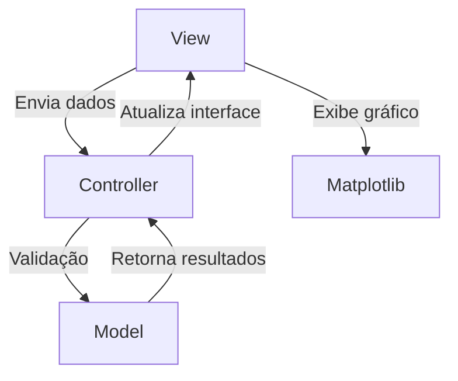
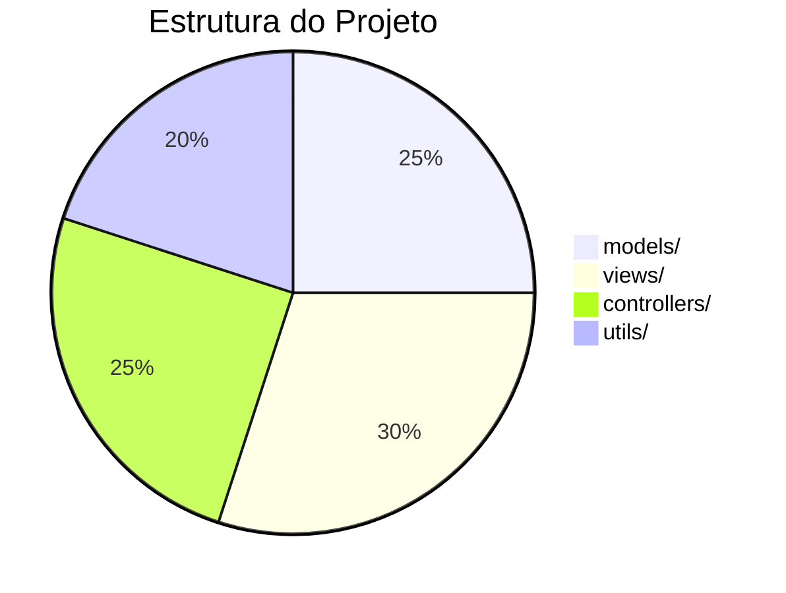
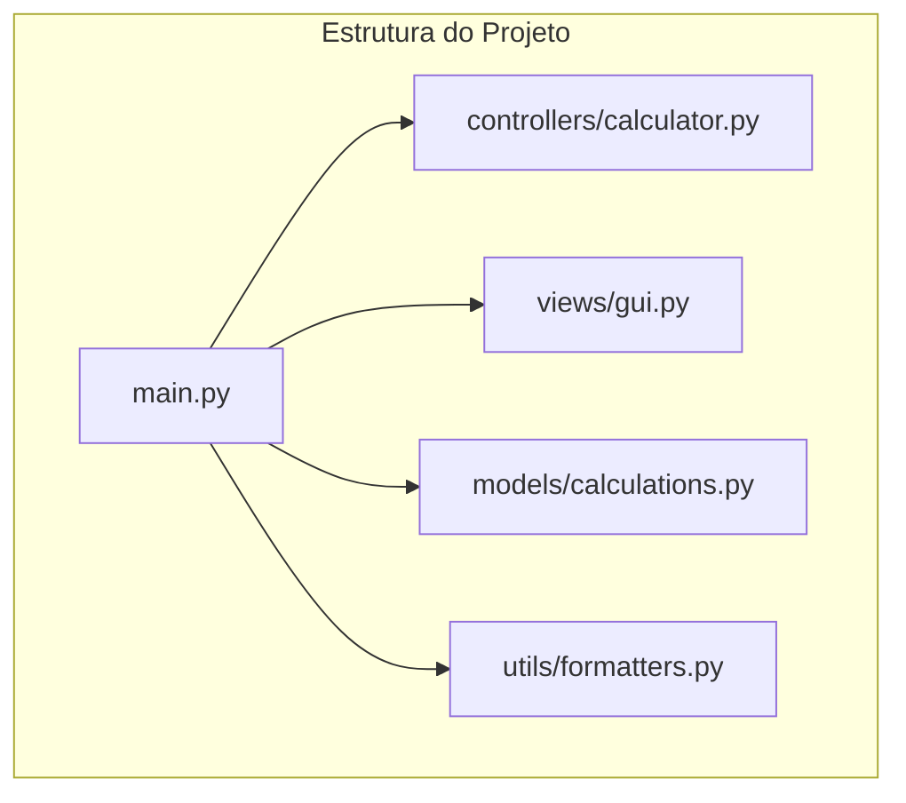

# 📊 Calculadora de Juros Compostos - Projeto de Aprendizado


Este projeto é uma calculadora de juros compostos desenvolvida para fins educacionais, demonstrando boas práticas de organização de código em Python para projetos profissionais.

## 🎯 Objetivo Principal

Ensinar como organizar um projeto Python em uma estrutura profissional seguindo o padrão MVC (Model-View-Controller):



## ✨ Funcionalidades Principais

- 💰 Cálculo preciso de juros compostos
- 📈 Visualização gráfica interativa
- 🎨 Interface intuitiva com Tkinter
- ✅ Validação robusta de entradas
- 💵 Formatação monetária automática
- 🖥️ Responsividade para diferentes tamanhos de tela

## 🛠️ Como Executar

1. **Clone o repositório**:
   ```bash
   git clone https://github.com/Monokatarina/juros-compostos.git
   cd juros-compostos
   ```

2. **Instale as dependências**:
   ```bash
   pip install -r requirements.txt
   ```

3. **Execute o programa**:
   ```bash
   python main.py
   ```


## 🧠 Conceitos Aprendidos

### Organização Profissional


### Tecnologias Utilizadas
| Tecnologia | Finalidade |
|------------|------------|
| Python | Lógica principal |
| Tkinter | Interface gráfica |
| Matplotlib | Visualização de dados |
| Mermaid | Diagramas no README |

## 📚 Estrutura Detalhada



**Legenda completa**:
- `models/`: Contém as fórmulas matemáticas
- `views/`: Interface do usuário e gráficos
- `controllers/`: Validação e controle de fluxo
- `utils/`: Funções auxiliares

## 🤝 Como Contribuir

1. Faça um fork do projeto
2. Crie uma branch para sua feature (`git checkout -b feature/incrivel`)
3. Commit suas mudanças (`git commit -m 'Adiciona feature incrível'`)
4. Push para a branch (`git push origin feature/incrivel`)
5. Abra um Pull Request

## 📄 Licença

Este projeto está licenciado sob a licença MIT - veja o arquivo [LICENSE](LICENSE) para detalhes.

---

Feito com ❤️ por [Monokatarina] - Transformando linhas de código em conhecimento! 🚀

[](https://github.com/Monokatarina/juros-compostos)
[](https://github.com/Monokatarina/juros-compostos/network)

## 🏆 Exemplo de Uso

```python
# Exemplo simplificado da lógica principal
from models.calculations import calcular_juros_compostos

resultado = calcular_juros_compostos(
    capital_inicial=1000,
    taxa_juros=8,  # 8% ao ano
    tempo=5        # 5 anos
)
print(f"Montante final: R${resultado:,.2f}")
```
